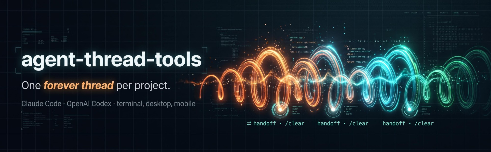
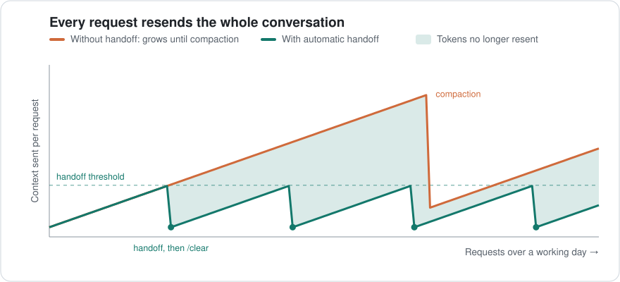

<div align="center">



<a href="#-two-commands"></a>
<a href="docs/handoff.md#codex"></a>
<a href="https://www.npmjs.com/package/agent-thread-tools"></a>
<a href="docs/claude-code.md#jev-optional"></a>


<a href="LICENSE"></a>

</div>

# Spend your usage limits on work, not on re-reading history.

Without agent-thread-tools, every request resends the whole conversation. With it,
each long Claude Code or Codex session hands off before it bloats, so every project
runs as one ***forever thread*** at a ***fraction*** of the tokens.

| <br>**30–40% fewer tokens**<br>in long sessions, so plan usage limits go further. | <br>**No quality loss**<br>Handoffs are audited; open items always carry forward. | <br>**Everywhere you code**<br>Claude Code and Codex: terminal, desktop, mobile. |
| :-- | :-- | :-- |



Past a threshold (300k tokens on a 1M-context model, half the window on a smaller
one), Claude writes and checks a handoff of everything still open. You run `/clear`,
the handoff loads on its own, and work carries on in a small, fresh session.
[How the savings are measured →](docs/token-savings.md)

## ⚖️ Powered by Jev, optional

The judgment calls come from Jev, TypeSafe's yes/no decision model on OpenRouter:
when to hand off, and whether the handoff left anything out. About 0.2 seconds a
question, a fraction of a cent a handoff.

| With Jev | Without Jev |
| --- | --- |
| ✓ Hands off at a natural break | Hands off at the threshold, even mid-task |
| ✓ Audits the handoff, open items too | No audit |
| ✓ Ranks what the draft keeps | The draft keeps the latest messages |
| ✓ Counts corrections afterwards | Savings measured, quality not |

In real use Jev held a handoff at 329k while work was mid-way, and its audit caught
seven owed device checks a handoff had dropped. It runs on your own OpenRouter key
and sees only redacted excerpts. [Set up Jev →](docs/claude-code.md#jev-optional)

## 🚀 Two commands

In any Claude Code session:

```text
/plugin marketplace add zenzig/agent-thread-tools
/plugin install agent-thread-tools@agent-thread-tools
```

Then just work. Check any session with `/agent-thread-tools:thread-health`, or hand
off yourself with `/agent-thread-tools:thread-handoff`. For Codex and the
command-line tools, `npm install -g agent-thread-tools`; see the
[installation guide](docs/installation.md).

## 🔐 What it runs and sends

Everything runs on your machine from readable Python and JavaScript, with no
telemetry. A hook reads the end of the session's transcript after each turn; the
handoff skill writes the handoff, `CLAUDE.md`, `CLAUDE.local.md`, and a local
`.reference/` git repository that is never pushed. Nothing leaves the machine unless
you add an OpenRouter key for Jev, which then receives redacted excerpts.
[PRIVACY.md](PRIVACY.md) lists every file and every excerpt.

## 📚 Documentation

| | |
| --- | --- |
| [Automatic handoff](docs/claude-code.md#automatic-handoff) | Threshold, Jev, the hooks |
| [Token savings](docs/token-savings.md) | How they're measured, and the usage limits |
| [Health checks](docs/health.md) | Every project at a glance, locally or over SSH |
| [Codex](docs/handoff.md#codex) | The Codex skill and handoff |
| [Commands](docs/commands.md) | Every command, including archives and recovery |
| [Privacy](PRIVACY.md) | What runs and what's sent |

All guides: [Documentation](docs/README.md).

## 📋 Project

<table>
  <tr><td>🏷️ <strong>Version</strong></td><td><code>2.1.1</code> · <a href="CHANGELOG.md">Changelog</a> · formerly <code>codex-thread-tools</code></td></tr>
  <tr><td>🐛 <strong>Issues</strong></td><td><a href="https://github.com/zenzig/agent-thread-tools/issues">Report a bug or request a feature</a></td></tr>
  <tr><td>🔒 <strong>Security</strong></td><td>Read the <a href="SECURITY.md">security policy</a> before reporting a vulnerability</td></tr>
  <tr><td>⚖️ <strong>License</strong></td><td><a href="LICENSE">MIT</a></td></tr>
</table>
